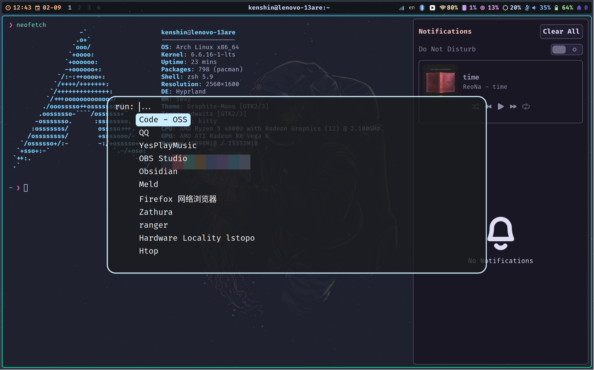

My personal dotfiles for ArchLinux (Hyprland).

---

---

Thanks:

- [Hyprland Wiki](https://wiki.hyprland.org/) almost everything for hyprland :)
- [LazyVim](https://www.lazyvim.org/) nvim
- [sgj123456/dotfiles](https://github.com/sgj123456/dotfiles) waybar(modified)
- [Wayland - 平铺窗口管理器 - Hyprland 折腾记](https://zhuanlan.zhihu.com/p/646864577) xwayland
- [Hyprland 环境配置与美化 // Isoheptane](https://cascade.moe/posts/hyprland-configure) tofi
- [rose-pine/swaync: Soho vibes for SwayNotificationCenter](https://github.com/rose-pine/swaync) swaync
- [dracula/swaylock: 🧛Dark theme for Swaylock ](https://github.com/dracula/swaylock) swaylock
- [davidmathers/tokyo-night-kitty-theme](https://github.com/davidmathers/tokyo-night-kitty-theme) kitty

